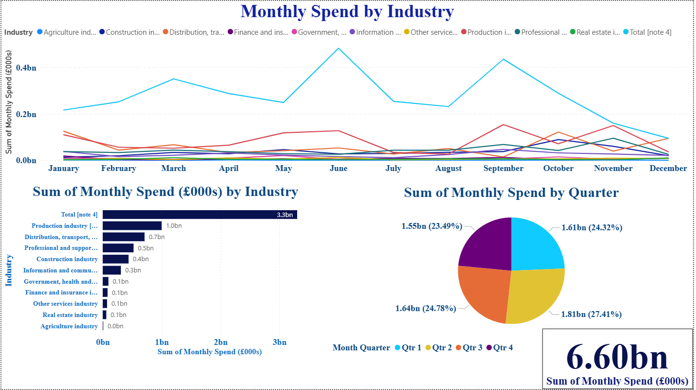

# UK Industry Spend Dashboard 📊

A clean, portfolio-ready analytics project that transforms UK ONS industry–product spend data into **monthly insights** and visualises them in **Power BI**.  
It demonstrates practical skills in **Python (pandas, NumPy)**, **data modelling**, and **BI storytelling** using a reproducible pipeline.

---

## Overview

This project simulates **monthly spend** by UK industries across product groups using constrained annual values from the **Office for National Statistics (ONS)**.

**Key outcomes:**
- Monthly trends by industry and product group
- Ready-to-use CSV for BI tools
- Reproducible Python script

---

## Data Source

- **ONS Annual Purchases Survey 2023**  
  Source: https://www.ons.gov.uk/

> ⚠️ Note: The raw data provides **annual** values. Monthly splits are **synthetic and illustrative** for dashboarding purposes only.

---

## Features

- Reshapes wide ONS tables into tidy format
- Simulates monthly spending distribution per industry–product group
- Exports clean CSV for dashboards
- Dashboard includes KPIs, trends, and a matrix view

---

## Repository Structure
UK-Industry-Spend-Dashboard/
├── data/
│ └── simulated_monthly_spend_data.csv
├── scripts/
│ └── generate_monthly_data.py
├── visuals/
│ └── dashboard_screenshot.png
└── README.md

---

## How to Run the Script

1. Download the original Excel file from ONS and place it in the project root:

energygoodsandservices2023100425.xlsx

2. Run the Python script:
python scripts/generate_monthly_data.py

3. The output will be saved to:
data/simulated_monthly_spend_data.csv

---

## Power BI Dashboard Highlights

- 📈 **Line Chart**: Monthly spend by industry
- 📊 **Bar Chart**: Total spend by industry
- 🧮 **Matrix**: Product group × industry
- 🏆 **KPI Card**: Total spend overview

*Screenshot:*

---

## Author

**Bhanu Prakash Jajapuram**  
MSc in Business Analytics | Data Analyst | Python + Power BI Enthusiast  
📧 bhanujajapuram1187@gmail.com

